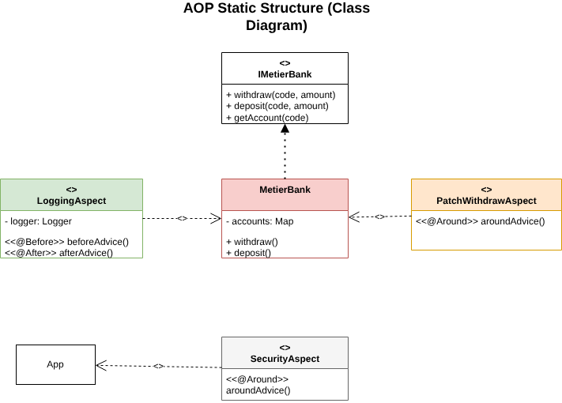
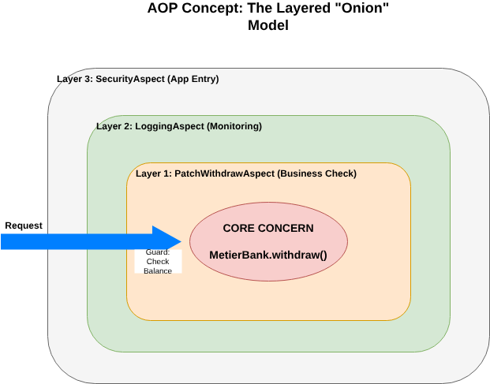

# Java AOP Demo (AspectJ)

This project demonstrates **Aspect-Oriented Programming (AOP)** using **AspectJ** to separate cross-cutting concerns (like logging and security) from the core business logic.

## 📌 Concepts
**AOP (Aspect-Oriented Programming)** allows you to modularize "cross-cutting concerns"—functionality that spans multiple parts of an application (e.g., logging, transaction management, security).

**AspectJ** is a powerful AOP extension for Java that allows defining:
- **Aspects**: Modules for cross-cutting concerns.
- **Advice**: Code to execute (`@Before`, `@After`, `@Around`).
- **Pointcuts**: Expressions matching join points (method executions).

---

## 🏗 Architecture
The project is structured into **Core Business Logic** (`MetierBank`) and **Aspects**.


### 1. Static Structure
The class diagram highlights the separation between the `MetierBank` class and the Aspect classes.  


### 2. Conceptual Model ("Onion")
Visualizing the system as layers protecting the core logic.  


---

## 💻 Code Samples

### 1. Core Logic (`MetierBank`)
The business logic is pure and unaware of logging or security checks.
```java
public void withdraw(Long code, Double amount) {
    Account account = accounts.get(code);
    if (account != null) {
        Double newBalance = account.getBalance() - amount;
        account.setBalance(newBalance);
    }
}
```

### 2. Logging Aspect (`@Before` / `@After`)
Intercepts execution to log start and end times.
```java
@Aspect
public class LoggingAspect {
    @Before("execution(* me.elamranioussama.metier.MetierBank.*(..))")
    public void beforeAdvice(JoinPoint joinPoint) {
        System.out.println("Log: Operation started " + joinPoint.getSignature());
    }
    
    @After("execution(* me.elamranioussama.metier.MetierBank.*(..))")
    public void afterAdvice(JoinPoint joinPoint) {
        System.out.println("Log: Operation finished");
    }
}
```

### 3. Security/Validation Aspect (`@Around`)
Intercepts `withdraw` to enforce business rules (e.g., insufficient balance) **before** the method runs.
```java
@Aspect
public class PatchWithdrawAspect {
    @Around("execution(* me.elamranioussama.metier.MetierBank.withdraw(..)) && args(code, amount)")
    public Object aroundAdvice(Long code, Double amount, ProceedingJoinPoint pjp) throws Throwable {
        // ... retrieve account ...
        if (account.getBalance() < amount) {
            System.out.println("⛔ Generic Block: Insufficient Funds!");
            return null; // Blocks execution of the real withdraw method
        }
        return pjp.proceed(); // Allows execution
    }
}
```

## 🚀 How to Run
1. Clone the repository.
2. Build with Maven: `mvn clean install`
3. Run the App: `java -cp ... me.elamranioussama.App`
   *(Note: The SecurityAspect currently blocks the main method for demonstration purposes)*.
